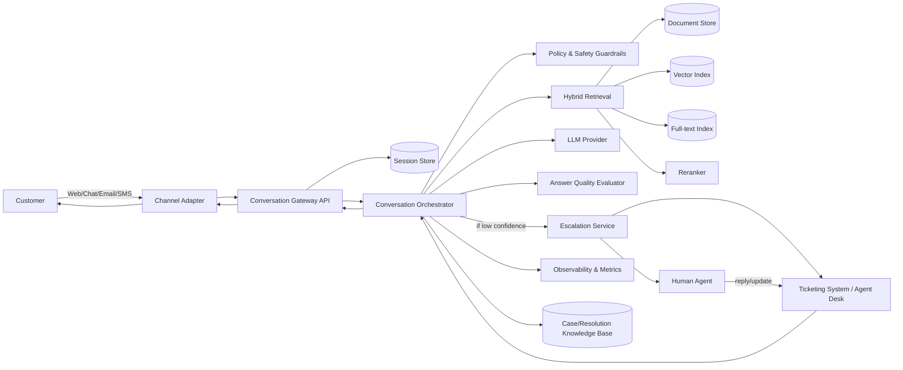
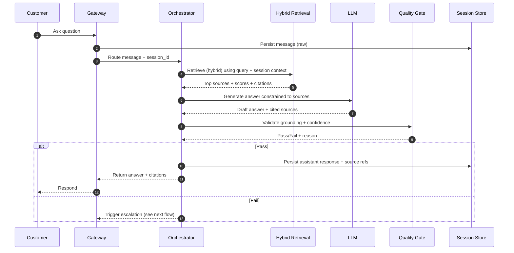
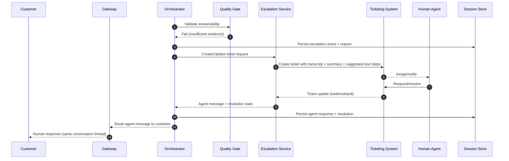

# Reference Architecture & Workflows

## Goal
Automate customer support inquiries with a chatbot pattern backed by Hybrid RAG, and escalate to a live representative when answer quality is below a defined threshold—without breaking the conversation chain.

## Architecture (logical components)

### Why these components
- **Channel Adapter + Gateway**: isolates channel-specific quirks (email threading, chat typing, auth) from core logic; reduces coupling and improves testability.
- **Orchestrator (state machine)**: conversation handling is inherently stateful (session, retries, escalation, resolution). A dedicated orchestrator makes “continue until resolved” reliable and auditable.
- **Hybrid Retrieval + Reranking**: support content often has both keyword-heavy and semantic queries; hybrid retrieval improves recall while reranking improves precision.
- **Answer Quality Evaluator**: the “do not guess” requirement needs an explicit gate that can block responses even if the LLM is willing to answer.
- **Ticketing integration**: ensures escalations land in the existing human workflow with full context.

## Core workflow: answer with evidence

### Why “citations-first”
Requiring citations (URLs, document paths, KB article IDs, or structured record IDs) operationalizes “don’t hallucinate”. It also improves debuggability: when an answer is wrong, the fix is usually retrieval/indexing—not prompt tweaks.

## Escalation workflow: low confidence → human (without losing context)

### What gets sent to the human agent (and why)
- **Transcript**: prevents the user from repeating information; reduces handle time.
- **Context summary**: lets an agent skim quickly; summary is also re-usable for post-resolution.
- **Retrieval evidence + “why failed”**: helps agents see what the bot searched and why it refused to answer (missing doc, conflicting sources, low similarity, no entitlement).
- **Suggested clarifying questions**: keeps momentum and improves data capture for later retrieval.

## Component choices (recommended defaults)
These are defaults you can implement quickly, while keeping provider flexibility.

- **Session store**: PostgreSQL (relational integrity, easy analytics, durable audit trail).
- **Hybrid search**:
  - Default: PostgreSQL full-text (`tsvector`) + `pgvector` for semantic search in the same data plane.
  - Reasoning: simplest operationally (one DB), good enough for many orgs, easy to evolve.
  - Scale-out option: dedicated search (OpenSearch/Elasticsearch/Azure AI Search) + vector DB when corpus/traffic demands it.
- **Orchestration**: a small service with an explicit conversation state machine (rather than embedding state into prompts), because it’s safer and easier to reason about escalation/resolution.

