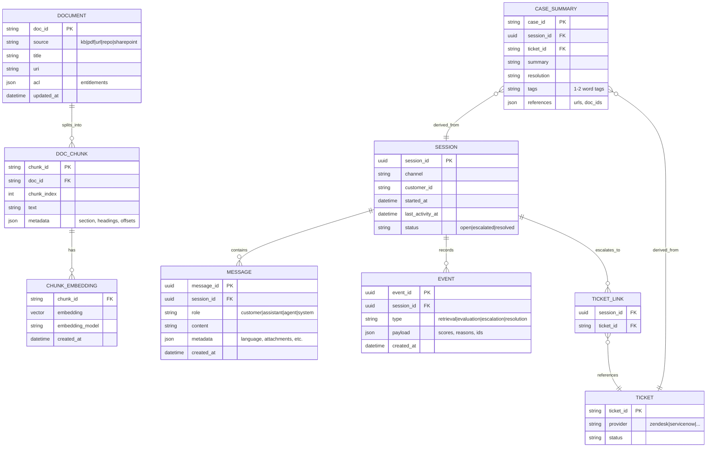

# Data Model & Hybrid RAG Design

## Goals for data capture
- Every session and every message is uniquely identifiable.
- The system can reconstruct: what the user asked, what was retrieved, what was answered, and why escalation happened.
- Stored content is optimized for later Hybrid RAG and metrics (not just logging).

## Entities (conceptual model)

### Why this model
- **SESSION/MESSAGE**: makes context management explicit and auditable; enables replay, summarization, and analytics.
- **EVENT**: preserves “why” (scores, thresholds, evaluator output). Without it, you can’t tune the escalation threshold or fix RAG issues reliably.
- **CASE_SUMMARY**: turns resolved tickets into durable knowledge that is easy to retrieve (and reduces repeated escalations).

## Session management strategy

### Identifiers
- Use **UUIDs** for `session_id` and `message_id` (prefer UUIDv7 if available) to ensure global uniqueness and time-ordered indexing.
- Store channel-specific IDs (email thread ID, chat conversation ID) in `SESSION.metadata` so you can correlate external systems without coupling your internal identity to them.

### Context handling
- Maintain two layers:
  1. **Immutable transcript**: every message stored verbatim.
  2. **Rolling summary memory**: periodically summarize the transcript into a compact “context summary” stored as an `EVENT` or a dedicated `SESSION.summary` field.
- Reasoning: long sessions quickly exceed LLM context limits; a rolling summary preserves continuity while keeping prompts small and cheaper.

## Hybrid RAG pipeline

### Ingestion (documents → searchable indices)
1. **Acquire**: pull KB articles, PDFs, web pages, internal docs.
2. **Normalize**: extract text + structure (title, headings, sections).
3. **Chunk**: split by semantic boundaries (headings/paragraphs) with max token targets.
4. **Enrich**: attach metadata (product, version, policy date), and ACL/entitlement rules.
5. **Index**:
   - Full-text index for lexical precision (error codes, SKUs, exact phrases).
   - Vector index for semantic recall (paraphrases, vague descriptions).

### Retrieval (query → evidence set)
- Run **full-text search** and **vector search** in parallel, then merge results with weights.
- Apply a **reranker** (cross-encoder or LLM-based) on the merged set to improve top-precision.
- Return:
  - top chunks (with doc URIs),
  - relevance scores,
  - and a compact “evidence pack” for prompting.

### Why Hybrid RAG (not vector-only)
- Support questions often include exact tokens that matter (order IDs, error codes, SKU names). Full-text helps precision.
- Vector search handles paraphrases and under-specified questions better. Hybrid improves recall while keeping grounding strict.

## Grounded generation & refusal

### Prompting constraints (design intent)
- The LLM must answer **only from retrieved chunks** (or explicitly from approved structured sources).
- The response must include **references** (URL/path/doc_id) for each material claim.

### Refusal/escalation triggers (the “response threshold”)
Escalate to human when any of the following is true:
- **No evidence**: retrieval returns nothing above a minimum relevance threshold.
- **Insufficient coverage**: evidence does not cover the question’s required fields (e.g., steps, policy, eligibility).
- **Conflicts**: top sources disagree or are outdated (e.g., different policy versions).
- **No-citation answer**: the model cannot produce a citation-backed response.
- **Evaluator fail**: post-generation quality gate indicates low confidence or missing grounding.

### Why an explicit evaluator
LLMs are optimized to be helpful and may “fill gaps” unless constrained. A separate evaluator reduces hallucination risk and provides a consistent reason for escalation that can be measured and tuned.

## Post-resolution knowledge capture
- Generate a **resolution summary** that includes:
  - the initial question,
  - key facts collected,
  - the final resolution,
  - and all reference links/URIs used.
- Apply **1–2 word tags** (e.g., `billing`, `login`, `api-error`) for quick filtering and metrics.
- Store the summary as `CASE_SUMMARY` and index it for retrieval.

### Why store case summaries as knowledge
Many escalations repeat. Turning resolved tickets into retrievable “cases” increases deflection over time while remaining grounded in real outcomes.

