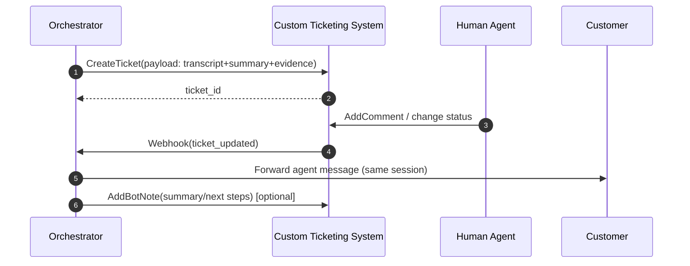

# Generic Custom Ticketing System: Integration Strategy

## Recommended integration shape

### Option A (preferred): Event-driven (webhooks)
**Why**: lower latency, lower cost, fewer “missed updates” than polling, and easier to keep the user conversation synchronized with the agent’s actions.

### Option B: Polling (fallback)
**Why**: some custom systems can’t send webhooks or have unreliable outbound connectivity.

Implementation guidance:
- Use a dedicated **Ticket Sync Worker** that polls “tickets updated since timestamp”.
- Store a **cursor** (timestamp + last_ticket_id) to guarantee progress.
- Use idempotency keys to avoid duplicating mirrored comments.

## Reliability and data consistency

### Outbox + idempotency (recommended)
**Why**: ticket creation and “mirror agent comment back to chat” are multi-system operations; without an outbox you can lose messages during partial failures.

Pattern:
- Write “create ticket” intent into your DB in the same transaction as the escalation event.
- A worker reads the outbox, calls the ticketing API, then marks the outbox item complete.
- Use a deterministic idempotency key (e.g., `session_id + escalation_event_id`).

## Escalation payload (what to send)
Include the following fields on ticket creation (and keep them updated):
- **Transcript**: full message history (verbatim).
- **Context summary**: rolling summary + current user intent.
- **Evidence pack**: retrieved doc links/ids, scores, and timestamps.
- **Escalation reason**: “no evidence / conflict / low confidence / missing entitlement”.
- **Suggested questions**: clarifiers the agent can ask if needed.

**Why**: this reduces agent handle time and provides auditable “why we escalated” signals for later tuning.

## Continuing the conversation chain until resolved
Design your ticketing system to support:
- A stable `external_conversation_id` (your `session_id`).
- Ticket status transitions that map to `open → escalated → resolved`.
- Agent comments that can be flagged as “customer-visible” vs “internal notes”.

**Why**: the bot must be able to route customer-visible agent responses back to the original channel while retaining internal operational notes.

## Post-resolution learning workflow
1. Detect resolution (ticket closed/resolved + final agent comment).
2. Generate **resolution summary** + **1–2 word tags**.
3. Store as a `CASE_SUMMARY` and index for Hybrid RAG retrieval.

**Why**: custom systems can directly embed “case summaries” as a native artifact (e.g., a “Resolution Article” linked to the ticket), reducing future escalations.

