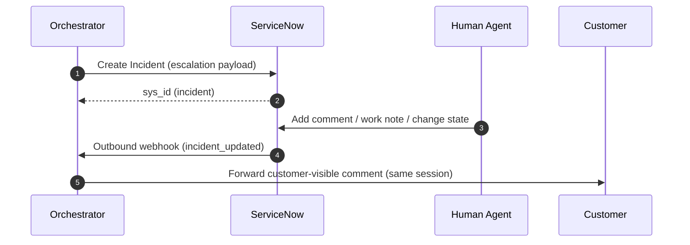

# ServiceNow: Integration Strategy

## Recommended integration shape

### Create/update incidents via ServiceNow APIs
**Why**: the incident record is the operational hub for assignment, SLAs, and audit; the bot should integrate cleanly with that flow.

Core actions:
- Create incident on escalation.
- Append customer follow-ups as additional comments.
- Ingest agent updates to continue the same conversation chain.

## Eventing options (choose one)

### Option A (preferred): Outbound notifications from ServiceNow (webhook pattern)
**Why**: near-real-time agent updates without polling, while staying inside ServiceNow governance.

Typical implementation:
- Business Rule / Flow / IntegrationHub action triggers on incident update (e.g., new customer-visible comment, state change).
- Sends a webhook to your orchestrator endpoint with `sys_id` and the latest update.

### Option B: Polling the Table API (fallback)
**Why**: required when outbound calls are blocked or approvals are difficult.

Implementation notes:
- Poll incidents linked to active sessions by `external_conversation_id`.
- Fetch only updates since last cursor (store last `sys_updated_on` + last seen journal entry id).
- Ensure idempotent mirroring.

## Authentication and network posture
Recommended default: OAuth with least-privilege integration user.
- If ServiceNow is isolated/on-prem: consider MID Server or controlled egress for outbound webhooks.

**Why**: many ServiceNow environments prohibit direct inbound calls from the internet; designing for this early avoids rework.

## Escalation payload design (ServiceNow-native)
On incident creation:
- **Short description**: derived from initial user question.
- **Description**: context summary + transcript excerpt + escalation reason.
- **Category/subcategory**: from your 1–2 word tags (or a mapping table).
- **Correlation ID**: store `session_id` in a dedicated correlation field (or a custom field).
- **Work notes**: evidence pack + “why refused” details.

**Why**: keeps customer-visible comments clean while providing agents the operational context needed to resolve quickly.

## Post-resolution learning
On incident resolution:
1. Generate resolution summary + tags + references.
2. Store in your KB store as `CASE_SUMMARY` and index for Hybrid RAG.
3. Optionally write back to the incident as a final work note for audit.

