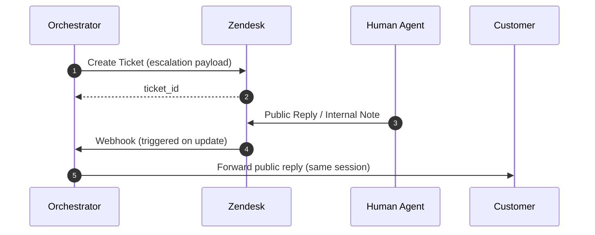

# Zendesk: Integration Strategy

## Recommended integration shape

### Ticket creation + updates via Zendesk Support API
**Why**: the API provides a stable, auditable source of truth for escalation, transcript storage, and agent collaboration.

Core actions:
- Create ticket on escalation.
- Add comments as conversation evolves (bot updates, agent replies, customer follow-ups).
- Read ticket status and public comments to continue the conversation chain.

## Eventing options (choose one)

### Option A (preferred): Zendesk Triggers → Webhooks → Orchestrator
**Why**: near-real-time updates when agents respond; avoids polling costs and reduces user wait time.

Implementation notes:
- Configure triggers to fire only on **public comment added** (or on specific field changes).
- Include the bot’s `session_id` in a **custom field** or `external_id` to correlate.

### Option B: Poll with incremental export APIs (fallback)
**Why**: simplest when you can’t use webhooks (networking constraints, governance).

Implementation notes:
- Poll “tickets updated since cursor”.
- Fetch only new comments.
- Use idempotency to avoid duplicating mirrored replies.

## Escalation payload design (Zendesk-native)
On ticket creation:
- **Subject**: derived from first user question + primary tag.
- **Description**: context summary + initial transcript excerpt + escalation reason.
- **Tags**: 1–2 word categorization tags + `ai_escalated`.
- **Custom fields**: `external_conversation_id`, `ai_escalation_reason`, `ai_confidence`.
- **Internal note** (optional but recommended): evidence pack (doc URIs, scores) + “why refused” details.

**Why**: agents can immediately act; internal note preserves technical context without exposing it to customers.

## Continuing the conversation chain
Treat Zendesk as the human collaboration surface, but keep your session as the canonical conversation:
- Mirror **customer follow-ups** into the existing ticket as a public comment.
- Mirror **agent public replies** back to the customer channel.
- Ingest **agent internal notes** as internal context (for summarization and metrics) but do not expose them.

## Post-resolution learning
On ticket solve/close:
1. Generate a resolution summary (include final steps + references).
2. Attach as an internal note and store as `CASE_SUMMARY` in your KB store.
3. Index for Hybrid RAG retrieval.

**Why**: Zendesk tickets are a rich source of real outcomes; case summaries reduce repeat escalations.

