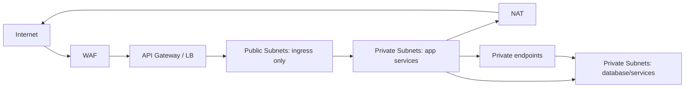
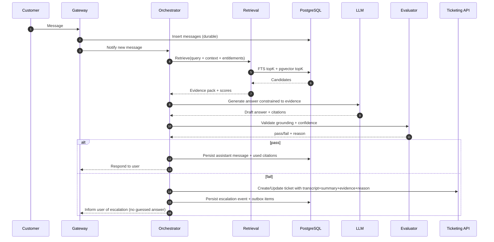

# Generic Custom Ticketing System (IaaS) — Cloud Component Design

This document defines an efficient, cost-effective, cloud-based **system/component design** for the **Generic Custom Ticketing System**, derived from the strategy in `Strategy/Generic-Custom-Ticketing-System/` (session identity, Hybrid RAG, strict grounding, human escalation with transcript+summary, post-resolution learning, and reliability via outbox/idempotency).

Naming rule used throughout: cloud component equivalents are written as `aws-…_az-…_gc-…`. If a provider lacks a practical equivalent, it is marked `aws-custom` / `az-custom` / `gc-custom`.

## 1) Objectives and quality bars

### 1.1 Primary objectives
- Automate customer inquiries with a chatbot using **Hybrid RAG** (full-text + vector) and **citations-first** responses.
- Enforce **“do not guess”**: if evidence is missing/insufficient, escalate to a human agent in the custom ticketing system.
- Maintain a single **conversation chain** until resolution (bot + human), identified by a stable `session_id`.
- Persist every message, decision, retrieval artifact, and outcome for **RAG reuse** and **metrics**.

### 1.2 Required behaviors (acceptance criteria)
- **Session management**: every conversation has a globally unique `session_id`; every message has a unique `message_id`.
- **Grounding**: bot answers only with retrieved evidence or approved structured records; otherwise it refuses/escalates.
- **Escalation**: ticket created/updated with transcript + context summary + evidence pack + escalation reason; chain continues until resolved.
- **Post-resolution**: generate summary + resolution + references + 1–2 word tags; index for retrieval.

## 2) Logical architecture (provider-agnostic)

```mermaid
flowchart TB
  subgraph Edge["Edge"]
    WAF[WAF + Rate limits]
    API[API Gateway / L7 Load Balancer]
    CDN[CDN for static agent UI]
  end

  subgraph App["App (private network)"]
    GW[Conversation Gateway]
    ORCH[Conversation Orchestrator]
    RET[Hybrid Retrieval]
    EVAL[Answer Quality Evaluator]
    TKT[Custom Ticketing API]
    SYNC[Ticket Sync Worker]
    ING[Ingestion/Embedding Workers]
  end

  subgraph Data["Data Plane"]
    PG[(PostgreSQL: sessions/messages/tickets + FTS + pgvector)]
    OBJ[(Object Storage: documents + attachments)]
    Q[(Queue / PubSub)]
    REDIS[(Redis - optional)]
  end

  subgraph AI["AI"]
    LLM[LLM (chat + summarization)]
    EMB[Embedding model]
    RER[Optional reranker model]
  end

  WAF --> API --> GW --> ORCH
  ORCH --> RET --> PG
  RET --> OBJ
  ORCH --> EVAL --> LLM
  ORCH --> LLM
  ORCH --> EMB
  ORCH --> Q --> ING --> PG
  ING --> OBJ
  ORCH --> TKT --> PG
  SYNC --> TKT
  SYNC --> ORCH
  REDIS -. optional .- GW
  CDN --> TKT
```

Why this shape (efficiency + cost):
- **One primary database** (PostgreSQL) for sessions/tickets + Hybrid RAG (FTS + `pgvector`) reduces service sprawl and ops burden.
- **Async workers** isolate variable-cost workloads (ingestion, embedding, offline evaluation) from user latency paths.
- **Evaluator gate** operationalizes “don’t hallucinate” and produces measurable refusal/escalation reasons.
- **Outbox + idempotency** provides reliable cross-component behavior without distributed transactions.

## 3) Cross-cloud component equivalents (underscore-separated)

### 3.1 Component mapping table (recommended default)

| Logical capability | Component equivalent | Notes / reasoning |
|---|---|---|
| Virtual network | `aws-vpc_az-vnet_gc-vpc` | Private-by-default network boundary. |
| Private connectivity to services | `aws-privatelink_az-private-link_gc-private-service-connect` | Reduces data exfil risk; avoids public DB access. |
| Internet egress (private subnets) | `aws-nat-gateway_az-nat-gateway_gc-cloud-nat` | Controlled outbound (LLM endpoints, updates). |
| DNS | `aws-route53_az-dns_gc-cloud-dns` | Stable naming for APIs and UI. |
| TLS certificates | `aws-acm_az-key-vault-certificates_gc-certificate-manager` | Centralized cert issuance/rotation. |
| WAF | `aws-waf_az-front-door-waf_gc-cloud-armor` | Protects public endpoints; rate limits. |
| API gateway / management | `aws-api-gateway_az-api-management_gc-api-gateway` | Auth, throttling, routing, observability at edge. |
| L7 load balancer (if used) | `aws-alb_az-application-gateway_gc-https-load-balancer` | Use when you prefer LB-first ingress. |
| Container platform (default) | `aws-eks_az-aks_gc-gke` | Balanced ops burden; supports autoscaling and service separation. |
| Container registry | `aws-ecr_az-acr_gc-artifact-registry` | Store signed images; enforce provenance. |
| PostgreSQL (managed default) | `aws-rds-postgresql_az-postgresql-flexible-server_gc-cloudsql-postgresql` | Best cost/ops trade for most teams. |
| Object storage | `aws-s3_az-blob-storage_gc-cloud-storage` | Documents, attachments, ingestion artifacts. |
| Queue / PubSub | `aws-sqs_az-service-bus_gc-pubsub` | Async ingestion, embedding, outbox draining. |
| Secrets | `aws-secrets-manager_az-key-vault_gc-secret-manager` | Central secret storage and rotation. |
| Key management | `aws-kms_az-key-vault-keys_gc-cloud-kms` | Encrypt data at rest; envelope encryption. |
| Workload identity (K8s ↔ IAM) | `aws-iam-roles-for-service-accounts_az-workload-identity_gc-workload-identity` | Avoid long-lived credentials in pods. |
| Redis cache (optional) | `aws-elasticache-redis_az-cache-for-redis_gc-memorystore-redis` | Rate limiting, short-lived caching; not required for MVP. |
| Observability (logs/metrics) | `aws-cloudwatch_az-monitor_gc-cloud-operations` | Break down latency + quality metrics. |
| Tracing | `aws-xray_az-application-insights_gc-cloud-trace` | Track per-request retrieval + LLM latency. |
| Static site hosting (agent UI) | `aws-s3-static-website_az-blob-static-website_gc-cloud-storage-static-website` | Cheapest UI hosting; separates UI from API. |
| CDN (agent UI) | `aws-cloudfront_az-front-door_gc-cloud-cdn` | Faster UI globally; optional WAF at edge. |
| LLM API | `aws-bedrock_az-openai_gc-vertex-ai` | Managed LLM is cheapest to start (no GPUs). |
| Embeddings API | `aws-bedrock-embeddings_az-openai-embeddings_gc-vertex-ai-embeddings` | Embeddings for doc chunks and case summaries. |

### 3.2 When a “pure IaaS” posture is required
If policy requires self-hosting most services on VMs:
- Compute group: `aws-ec2-asg_az-vmss_gc-mig`
- PostgreSQL self-host (not recommended unless mandated): `aws-custom_az-custom_gc-custom`
- Message broker self-host (only if required): `aws-custom_az-custom_gc-custom` (e.g., RabbitMQ/Kafka on VMs)

Reasoning: this increases ops burden and usually increases total cost unless there are strong governance constraints.

## 4) Deployment topology (network + environments)

### 4.1 Environments
- `dev`: smallest footprint; single-zone acceptable; synthetic/sanitized data only.
- `stage`: production-like; used for evaluation regression and load testing.
- `prod`: multi-zone; backups; alerts; disaster recovery plan.

### 4.2 Network layout (prod)



Security posture:
- Only edge endpoints are public.
- App services and data are private-only.
- Egress is controlled (allowlist LLM endpoints if possible).

## 5) Runtime services (what runs, what it does, interfaces)

### 5.1 Conversation Gateway (`gw`)
Purpose:
- Receives inbound messages from channels (web chat, email adapter, SMS adapter).
- Ensures durable capture: write the raw message to the database before orchestration.

Runs on: `aws-eks_az-aks_gc-gke`

Primary interfaces (example REST; adapt to your channel):
- `POST /sessions` → create a new session (returns `session_id`)
- `POST /sessions/{session_id}/messages` → append customer message (returns `message_id`)
- `GET /sessions/{session_id}` → status (`open|escalated|resolved`), latest response pointer
- Optional: `GET /sessions/{session_id}/stream` (SSE) for streaming assistant output

Cost controls:
- Stateless and horizontally scalable.
- Optional Redis for rate limiting and ephemeral session routing.

### 5.2 Conversation Orchestrator (`orchestrator`)
Purpose:
- Implements the conversation state machine:
  - `open` → attempt grounded answer
  - `escalated` → route to human; mirror ticket updates
  - `resolved` → finalize summary + tags + references
- Owns the “continue until resolved” behavior.

Runs on: `aws-eks_az-aks_gc-gke`

Key actions:
- Retrieve evidence (calls `retrieval`).
- Generate answer with citations (calls LLM).
- Validate answerability (calls `evaluator`).
- Escalate (calls `ticketing-api` + writes outbox).
- Post-resolution summary + tagging (calls LLM or smaller model).

### 5.3 Hybrid Retrieval (`retrieval`)
Purpose:
- Hybrid RAG using:
  - full-text (PostgreSQL FTS) for exact terms (error codes, SKUs)
  - vectors (`pgvector`) for semantic matching
- Merge and rerank for precision.

Runs on: `aws-eks_az-aks_gc-gke`

Inputs:
- query text
- session context (rolling summary, known entities)
- caller identity/entitlements (for ACL filtering)

Outputs:
- evidence pack: top chunks with `{doc_uri|path, doc_id, chunk_id, score, retrieved_at}`
- retrieval diagnostics for `events` table

### 5.4 Answer Quality Evaluator (`evaluator`)
Purpose:
- Enforces “do not guess” with a multi-signal gate.

Runs on: `aws-eks_az-aks_gc-gke`

Signals (minimum):
- retrieval strength (top scores exceed threshold)
- evidence coverage (required fields supported)
- conflict detection (sources disagree or outdated)
- citation completeness (answer claims backed by evidence)

Outputs:
- `pass|fail`
- canonical reason code (e.g., `no_evidence`, `insufficient_coverage`, `conflicting_sources`, `missing_citations`, `llm_error`)
- numeric confidence (optional but useful)

Reasoning: separating evaluation makes behavior consistent and tunable without changing generation prompts.

### 5.5 Custom Ticketing API (`ticketing-api`)
Purpose:
- Provides the custom ticketing system backend.
- Stores all escalation payloads and human agent interactions.

Runs on: `aws-eks_az-aks_gc-gke`

Core entities (minimum):
- `Ticket` (linked to `session_id`)
- `TicketComment` (public vs internal; linked to `message_id` where applicable)

Core interfaces:
- `POST /tickets` (create from escalation)
- `PATCH /tickets/{ticket_id}` (status/assignment)
- `POST /tickets/{ticket_id}/comments` (public reply or internal note)
- `GET /tickets/{ticket_id}` (agent view)
- `GET /tickets?status=open|pending|...` (agent queue)

### 5.6 Agent Console (static web UI)
Purpose:
- Human interface to view escalations with transcript, summary, evidence, and respond.

Hosting:
- Static hosting: `aws-s3-static-website_az-blob-static-website_gc-cloud-storage-static-website`
- CDN: `aws-cloudfront_az-front-door_gc-cloud-cdn`

Auth:
- OIDC-backed login: `aws-cognito_az-entra-id-b2c_gc-identity-platform` (or enterprise SSO)

### 5.7 Ticket Sync Worker (`ticket-sync`)
Purpose:
- Keeps the conversation chain unified by mirroring:
  - agent public replies → customer channel
  - customer follow-ups → ticket comments
- Webhook preferred; polling fallback.

Runs on: `aws-eks_az-aks_gc-gke`

Reliability requirements:
- idempotency keys for every mirrored action
- durable cursor for polling (`updated_at` + last id)
- DLQ for poison events

### 5.8 Ingestion/Embedding Workers (`ingestion-workers`)
Purpose:
- Ingest documents and resolved case summaries:
  - extract text/OCR as needed
  - chunk
  - embed
  - index (FTS + vectors)
  - store raw and derived artifacts in object storage

Runs on:
- Worker compute: `aws-eks_az-aks_gc-gke` (spot/preemptible recommended)
- Queue: `aws-sqs_az-service-bus_gc-pubsub`

## 6) Data design (PostgreSQL + object storage)

### 6.1 PostgreSQL schemas/tables (minimum)
Align with `Strategy/Generic-Custom-Ticketing-System/Data-Contract.md`.

- `sessions(session_id, channel, customer_id, started_at, last_activity_at, status, summary_current)`
- `messages(message_id, session_id, role, content, metadata_json, created_at)`
- `events(event_id, session_id, type, payload_json, created_at)`
- `tickets(ticket_id, session_id, status, priority, tags, assigned_to, escalation_reason, ai_confidence, created_at, updated_at)`
- `ticket_comments(comment_id, ticket_id, author_type, visibility, body, source_message_id, created_at)`
- `documents(doc_id, source, title, uri, acl_json, updated_at)`
- `doc_chunks(chunk_id, doc_id, chunk_index, text, metadata_json, tsvector_column)`
- `doc_embeddings(chunk_id, embedding_vector, embedding_model, created_at)`
- `case_summaries(case_id, session_id, ticket_id, summary, resolution, tags, references_json, created_at)`
- `outbox(outbox_id, type, payload_json, idempotency_key, status, attempts, next_attempt_at, created_at)`

Indexes (minimum):
- `messages(session_id, created_at)`
- `events(session_id, created_at)`
- `tickets(session_id)`, `tickets(status, updated_at)`
- `doc_chunks` full-text index on `tsvector_column`
- `doc_embeddings` vector index (IVFFLAT/HNSW depending on extension/version)

Reasoning: these indices are essential for latency (retrieval) and operational queries (agent queues, metrics).

### 6.2 Object storage layout (example)
- `docs/raw/{source}/{doc_id}` (original files)
- `docs/text/{doc_id}.json` (extracted text + structure)
- `attachments/{ticket_id}/{attachment_id}` (customer attachments)
- `audit/evidence-packs/{session_id}/{event_id}.json` (optional deep audit artifacts)

Lifecycle policy:
- Keep raw docs long-term.
- Move large audit artifacts to cold storage after N days.

## 7) Hybrid RAG: detailed workflow (implementation-ready)



Key design choices and reasoning:
- Retrieval + evaluation are **first-class components** so “why escalated” is measurable and tunable.
- Evidence pack is persisted (in `events` and optionally object storage) for audit, debugging, and offline eval sets.

## 8) Escalation threshold design (multi-signal gate)

Use a decision rule (not a single number). Start conservative and tune using real transcripts.

Minimum gate inputs:
- `retrieval_top_score` and count above `min_relevance`
- `coverage_ok` (topic-specific slot coverage)
- `conflict_detected` (version/date mismatches, contradictory steps)
- `citations_complete` (every key claim has a citation)
- `llm_error` / provider availability

Escalate when any of the following is true:
- No evidence above threshold
- Coverage is insufficient
- Conflicts exist
- Citations missing/invalid
- LLM unavailable or evaluator errors (fail closed)

Why: this directly enforces “do not hallucinate” and yields stable operations across varied topics.

## 9) Reliability: outbox, idempotency, and delivery semantics

### 9.1 Outbox pattern (required)
Write an outbox row in the same database transaction as the state change.

Examples:
- When escalating, in one transaction:
  - insert escalation `event`
  - update `sessions.status = escalated`
  - insert `outbox(type='ticket.create', idempotency_key=session_id+event_id, payload=…)`

Outbox processor behavior:
- Read pending outbox rows in order
- Execute side effects (ticket create/update, webhook sends)
- Mark outbox row complete
- Retry with exponential backoff and cap
- Send to DLQ after N attempts

DLQ equivalents: `aws-sqs-dlq_az-service-bus-dead-letter_gc-pubsub-dead-letter`

### 9.2 Idempotency rules (required)
- Ticket creation: idempotency key = `session_id + escalation_event_id`
- Comment mirroring: dedupe by `source_message_id` (and/or external comment id)
- Webhook deliveries: include `event_id` and allow receiver-side dedupe

Delivery target: at-least-once with idempotent consumers (practical correctness).

## 10) Security controls (minimum viable set)

### 10.1 Data protection
- Encrypt at rest with `aws-kms_az-key-vault-keys_gc-cloud-kms`.
- Encrypt in transit everywhere (TLS).
- Separate raw transcript storage from retrieval-indexed text:
  - index a redacted/tokenized version when needed
  - enforce least privilege on raw tables

### 10.2 Access control
- Agent console RBAC:
  - `agent` (ticket work)
  - `supervisor` (assignment/queues)
  - `admin` (connectors/config)
- Document ACL enforcement at retrieval time:
  - store ACLs in `documents.acl_json`
  - filter retrieval candidates before returning evidence

### 10.3 Network and egress
- Private subnets for compute and data.
- Egress allowlist for LLM endpoints where feasible.
- WAF + API throttling to reduce abuse and cost spikes.

## 11) Observability and metrics (design-time instrumentation)

### 11.1 What to log/store (must be queryable)
- Retrieval diagnostics: query, top scores, doc/chunk ids.
- Evaluator decision + reason codes.
- Escalation events and ticket linkage.
- Latency breakdown per stage: gateway, retrieval, LLM, evaluator, ticketing.

### 11.2 Metrics to emit (minimum)
- Time to resolution
- Escalation rate and reasons
- Retrieval hit rate (evidence above threshold)
- Grounding pass rate (citations completeness)
- Similar question counts (by tags + embedding clustering offline)
- Cost per resolved issue (token + infra)

Cloud monitoring equivalents: `aws-cloudwatch_az-monitor_gc-cloud-operations`

## 12) Cost optimization levers (explicit)

### 12.1 Keep the always-on footprint minimal
Always-on services:
- `gw`, `orchestrator`, `retrieval`, `evaluator`, `ticketing-api`

Burst/elastic:
- `ingestion-workers`, offline evaluation, reindex jobs

### 12.2 Use interruptible compute where safe
- Workers on `aws-ec2-spot_az-spot-vm_gc-spot-vm` with checkpointing and retries.

### 12.3 Reduce token usage
- Rolling summary memory to limit prompt length.
- Cache evidence packs for repeated within-session questions (short TTL).
- Use smaller models for tagging/routing; reserve larger models for complex answers.

## 13) Implementation sequencing (derivable step-by-step plan)

1. Provision network: `aws-vpc_az-vnet_gc-vpc`, subnets, NAT, private endpoints.
2. Provision security primitives: `aws-kms_az-key-vault-keys_gc-cloud-kms`, `aws-secrets-manager_az-key-vault_gc-secret-manager`.
3. Provision data plane:
   - PostgreSQL: `aws-rds-postgresql_az-postgresql-flexible-server_gc-cloudsql-postgresql`
   - Object storage: `aws-s3_az-blob-storage_gc-cloud-storage`
4. Provision messaging: `aws-sqs_az-service-bus_gc-pubsub` + DLQ.
5. Provision compute:
   - `aws-eks_az-aks_gc-gke`
   - registry: `aws-ecr_az-acr_gc-artifact-registry`
6. Deploy core services: `gw`, `orchestrator`, `retrieval`, `evaluator`, `ticketing-api`.
7. Deploy agent console: static site + CDN.
8. Deploy workers: ingestion/embedding + outbox processor + ticket sync worker.
9. Configure observability: dashboards + alerts; verify evaluator reason codes and queue backlogs.
10. Tune thresholds conservatively; run staged rollout; create offline eval set from sanitized transcripts.

## 14) Minimal starting sizing (MVP → production)

MVP (cost-first):
- Small K8s cluster (2–3 nodes), single-zone acceptable in dev/stage.
- Managed PostgreSQL small tier, vertical scaling later.
- Workers scale from 0 based on queue depth.

Production (reliability-first):
- Multi-zone cluster and DB.
- Dedicated worker node pool with spot/preemptible and sufficient headroom.
- PITR enabled; regular restore tests.

